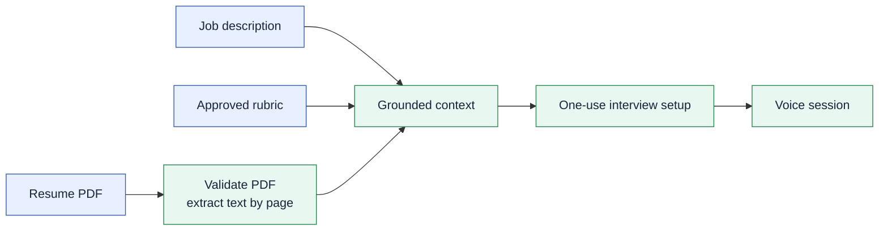
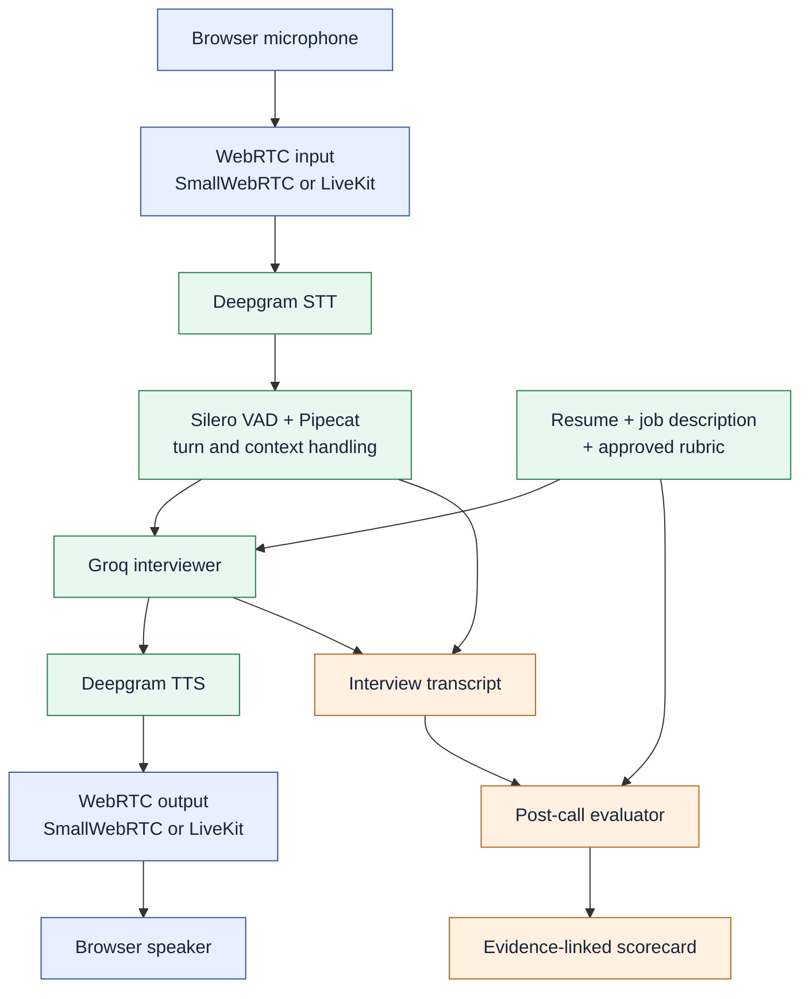

# InterviewFlow AI

### A voice interview coach grounded in your resume and the role you want

InterviewFlow AI runs a 15-minute English practice interview in the browser. Upload a resume PDF, paste a job description, review the scoring rubric, and speak with an AI interviewer. After the call, it produces a scorecard tied to what you actually said—not an invented assessment of what you might know.

[Try the hosted app](https://interviewflow-ai-mrinal.onrender.com) · [Architecture and module plan](blueprint.md) · [Module walkthroughs](docs/)

[](https://github.com/MARKEE-code-sketch/interviewflow-ai/actions/workflows/ci.yml)

> **Status:** Deployed portfolio MVP. Live voice quality, transcript accuracy, and scorecard calibration are still being improved. This is practice feedback, not an automated hiring decision.

## What it does

- Extracts selectable text from a PDF resume and preserves page references for grounded questions.
- Uses the job description and a candidate-approved technical rubric, labeled with the target role, as interview context.
- Streams microphone audio through a Pipecat STT → LLM → TTS pipeline, with live transcripts and interruption handling.
- Runs a server-controlled interview clock; the final two minutes are reserved for candidate questions.
- Evaluates completed answers against the approved rubric and links scored findings to exact transcript quotes. It requests human review when the evidence is insufficient or unreliable.

## How it works

The setup happens before the voice call. The PDF, job description, and approved rubric become a bounded, source-labeled context for the interviewer. The raw PDF is not saved.



During the call, Pipecat coordinates the streaming components. **STT** turns speech into text; **VAD** detects speaking and silence; the **LLM** chooses the next grounded question; **TTS** turns that reply into audio. Local development uses SmallWebRTC; the hosted app uses LiveKit. The interview logic is the same in both cases.



The evaluator runs **after** the call, outside the time-sensitive audio path. It validates rubric identity, criterion coverage, scores, and exact candidate quotations before showing a result. It does not claim to verify technical correctness without an approved reference answer.

## Stack

| Layer | Technology | Purpose |
| --- | --- | --- |
| Client | React, Vite, Pipecat client SDK | Setup form, live call, transcript, timer, scorecard |
| Voice orchestration | Python 3.12, Pipecat | Streaming pipeline, context, turns, interruptions |
| Transport | SmallWebRTC locally; LiveKit when hosted | Real-time browser audio |
| Speech | Deepgram STT and TTS; local Silero VAD | Transcription, spoken replies, speech detection |
| Interview and evaluation | Groq LLMs | Grounded questions and post-call rubric assessment |
| Storage | SQLite locally; PostgreSQL when hosted | One-use setup handoff and expiring scorecards |
| Quality and delivery | pytest, DeepEval, JiWER, Docker, GitHub Actions, Render | Tests, speech metrics, packaging, deployment |

## Run locally

You need Python 3.12, [uv](https://docs.astral.sh/uv/), Node.js 22, and API keys for Groq and Deepgram. These providers receive interview text and microphone audio respectively; see [data handling](#data-handling) before using a real resume. The commands below use PowerShell.

From the repository root, create your local configuration and fill in `GROQ_API_KEY` and `DEEPGRAM_API_KEY`:

```powershell
if (-not (Test-Path .env)) { Copy-Item .env.example .env }
```

Keep `VOICE_TRANSPORT=webrtc` and leave `DATABASE_URL` blank to use local SQLite. Then run the backend:

```powershell
cd server
uv sync --all-groups --frozen
uv run python bot.py -t webrtc
```

In a second terminal, from the repository root, run the client:

```powershell
cd client
npm.cmd ci
npm.cmd run dev
```

Open **http://localhost:5173**. Upload a selectable-text PDF (maximum 5 MB and 10 pages), enter a job description of at least 20 characters, approve the rubric, and start the interview. Image-only or scanned PDFs currently need OCR and are rejected.

To inspect PDF extraction before starting a call:

```powershell
cd server
uv run python scripts/check_resume.py "C:\path\to\resume.pdf"
```

## Test and evaluate

The normal CI path runs backend tests, client tests, and a production client build without making live provider calls:

```powershell
# From server/
uv run pytest -q

# From client/
npm.cmd test
npm.cmd run build
```

For a speech-recognition sample with known reference text, the [voice module walkthrough](docs/module-4-voice-pipeline.md) explains WER/CER evaluation. DeepEval and Pipecat evaluation scenarios are used for grounding and conversational behavior; their scores are signals to review, not proof of interview quality. Live calls and LLM-judge evaluations may consume provider credits and are run deliberately.

## Deployment

The root [render.yaml](render.yaml) defines a Docker backend and a static React frontend. Hosted sessions use LiveKit for audio and PostgreSQL for persistence; secrets are supplied in Render, never committed. The same backend pipeline is selected through `VOICE_TRANSPORT=livekit`. See the [production walkthrough](docs/module-8-production.md) for required environment variables and the deployment checklist.

## Data handling

- Raw PDF files and raw call audio are **not stored** by this application.
- Extracted resume text, job description, and rubric are held as a one-use setup, removed when the voice session claims it, and otherwise become inaccessible after one hour.
- Scorecards—including quoted answer evidence—become inaccessible after seven days. Expired database rows are cleaned up when those records are next queried; there is no scheduled purge job. The conversation transcript is kept in memory during the session for evaluation.
- Groq receives the grounded documents and conversation text. Deepgram receives candidate audio for transcription and reply text for speech synthesis. In hosted mode, LiveKit carries the call audio.
- Do not upload confidential material without permission. The current MVP does not provide account-level access control or a production privacy guarantee.

## Current limitations

The MVP is English-only and currently uses the same two-criterion technical rubric for every role; only the role title changes. Transcription can mishear technical terms or split an answer, which can also affect follow-up questions and scores. Scanned PDFs need OCR; technical-fact scoring needs approved reference material. Render's free backend may cold-start and is not a production availability or concurrency guarantee. These are active quality and hardening tasks, not completed capabilities.

## Repository guide

| Path | Responsibility |
| --- | --- |
| [`client/`](client/) | Browser setup, call, transcript, timer, and scorecard screens |
| [`server/interviewflow/`](server/interviewflow/) | Resume ingestion, grounding, voice pipeline, timing, evaluation, persistence |
| [`server/tests/`](server/tests/) | Deterministic backend regression tests |
| [`server/evals/`](server/evals/) | Deliberately run evaluation scenarios and speech-quality checks |
| [`docs/`](docs/) | Plain-language module walkthroughs |
| [`blueprint.md`](blueprint.md) | Full architecture, constraints, and module plan |

Built with the [Pipecat framework](https://github.com/pipecat-ai/pipecat) and informed by the [Pipecat examples](https://github.com/pipecat-ai/pipecat-examples).
