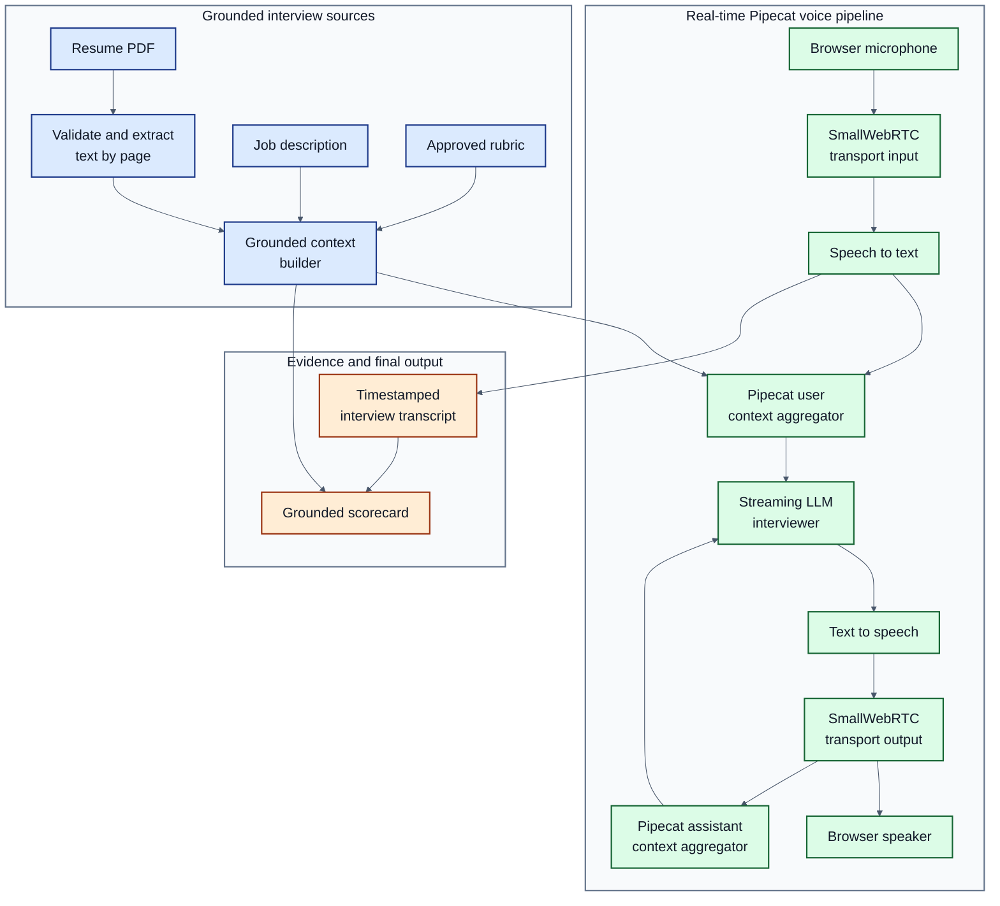

# InterviewFlow AI — Simplified Blueprint

## 1. What we are building

A browser-based English voice interviewer. The candidate uploads a resume PDF, supplies a job description, and completes a focused interview of up to 15 minutes. The interviewer asks relevant follow-ups and produces a scorecard whose findings point back to the source documents or transcript. the interviewer also has to access the universal correctness of the claims made by the cadidate. It has to be smart enough to catch the bluffs.

The MVP is English-only. Hindi is a later decision.

## 2. Problem statement

Generic mock interviews ignore the candidate's actual experience and the target role. Their feedback can also contain unsupported claims. InterviewFlow AI creates a real-time interview grounded in the candidate's resume, the job description, an approved rubric, and the candidate's spoken answers.

## 3. Grounding contract

Allowed evidence:

1. Validated resume text with page references
2. The supplied job description
3. An approved interview rubric and question bank
4. The timestamped interview transcript
5. Approved technical references or expected-answer elements for questions that require factual correctness

Rules:

- Candidate-specific questions must be traceable to resume or job-description evidence.
- General questions must be tied to an approved rubric or a job requirement.
- Scorecard observations must include source or transcript evidence.
- Technical correctness may be judged only when an approved reference or answer key is available.
- Missing evidence produces `insufficient evidence`, never an invented fact.
- The MVP passes the complete validated documents into context when they fit safely. Retrieval and a vector database are deferred until measurements show they are needed.

### Generalized role rubrics

We will not write a new evaluation engine for every job title. The engine reads one stable rubric schema, while the rubric contents change by role.

- A reusable competency catalog contains criteria such as communication, relevance, evidence, technical reasoning, system design, leadership, and model evaluation.
- A role template selects only the competencies relevant to that role and supplies definitions, weights, and role-specific 1–5 anchors.
- The job description can suggest adjustments, but it cannot silently change the rubric.
- A human reviews the draft. The approved rubric receives an ID, version, and content hash and becomes immutable for that interview.
- Each question declares which rubric criteria it can reasonably test. Non-applicable criteria are excluded, not scored as zero.
- The LLM returns evidence and criterion scores. Deterministic Python code calculates weighted totals and handles the case where nothing is applicable.

The canonical evaluator instructions are recorded in [docs/evaluation-engine-prompt.md](docs/evaluation-engine-prompt.md). They will be implemented and tested in Module 6.

## 4. MVP architecture

The live path stays close to Pipecat's official examples. PDF processing and score generation happen outside the latency-sensitive voice path.

### Reference implementation

We are using the official [Pipecat examples repository](https://github.com/pipecat-ai/pipecat-examples) as our implementation reference. The closest example is [StudyPal](https://github.com/pipecat-ai/pipecat-examples/tree/main/studypal), especially its [bot.py](https://github.com/pipecat-ai/pipecat-examples/blob/main/studypal/bot.py).

StudyPal demonstrates the pattern we want to preserve: load source content, place that content in the LLM's context, and use Pipecat's standard transport -> STT -> user context -> LLM -> TTS -> transport -> assistant context pipeline. We will reuse the pattern, not blindly copy the application: our project adds robust resume validation, page-level evidence, interview timing, grounded scoring, and component-level evaluation.

## 5. Module plan and verification gates

| Module                  | What it produces                                                          | Verification before moving on                                              |
| ----------------------- | ------------------------------------------------------------------------- | -------------------------------------------------------------------------- |
| 0. Project foundation   | Clean project skeleton, configuration, blank secret template              | Imports and configuration tests pass                                       |
| 1. PDF ingestion        | Validated, page-referenced resume text                                    | Gold PDF fixtures; text coverage, page attribution, and failure cases pass |
| 2. Grounded context     | Resume, job description, and rubric packaged with provenance              | No unsupported source entries; grounding tests pass                        |
| 3. Text interviewer     | Natural multi-turn interview without audio                                | Pipecat text evals plus DeepEval turn faithfulness and relevance           |
| 4. Voice pipeline       | WebRTC, STT, LLM, TTS, context, and interruption handling                 | Audio smoke test, WER/CER sample, interruption test, latency capture       |
| 5. Interview controller | Flexible 15-minute opening, questioning, candidate questions, and closing | Fake-clock tests and early-end behavior pass                               |
| 6. Scorecard            | Structured feedback with evidence references                              | Every scored finding has evidence; human-reviewed cases pass               |
| 7. Client               | Upload, job input, call controls, timer, transcript, and scorecard        | Each visible control works in an end-to-end browser check                  |
| 8. Production hardening | Durable setup/results, CI, Docker, Daily, and Render configuration         | Full regression suite and deployment smoke test pass                       |

No module is implemented until its short design explanation is approved.

### Module 1 decisions

- `pypdf` extracts text directly from PDF bytes; the raw uploaded file is not saved.
- Resume PDFs are limited to 5 MB and 10 pages before text extraction.
- Every extracted page keeps its page number so later questions and feedback can cite the source.
- Encrypted, corrupt, oversized, and non-PDF files are rejected with stable error codes.
- Blank or image-only PDFs are reported as having insufficient selectable text. OCR is deferred until it is separately approved.
- Loguru records safe operational metadata only; resume text and candidate identifiers are never logged.

### Module 2 decisions

- `rubric.py` validates the documented rubric schema and freezes criteria and score anchors after explicit human approval. Weights are finite positive relative values; they need not sum to 100.
- SHA-256 identifies the approved rubric content. This detects content changes when hashes are compared; it does not authenticate the approver.
- `grounded_context.py` combines Module 1 page text, job-description text, the rubric and optional human-approved technical references with source IDs.
- Fixed system instructions and JSON source data are separate messages. This preserves message boundaries; resistance to prompt injection must still be tested against the actual LLM in Module 3.
- No documents are sent externally. Context-window sizing will be checked when the LLM provider/model is selected; this module does not truncate evidence.
- See [the Module 2 walkthrough](docs/module-2-grounded-context.md) for the code flow and test command.

### Module 3 implementation status

- Groq is approved for the interviewer. `interviewer.py` configures the service; `interview_session.py` orchestrates Pipecat's native context aggregators and streamed text replies.
- A terminal runner supports fictional demo inputs or a real resume PDF with reviewed rubric/job-description JSON.
- Offline tests pass; live six-turn samples were run with Groq GPT-OSS 20B and 120B. The default is 20B; compound questions and inconsistent citations remain quality issues to evaluate further.
- Pipecat and DeepEval judge evaluations were run with approved Groq GPT-OSS 120B: G-Eval passed 5/6 scenarios and Pipecat passed 4/6. Manual review found missed requirements in judge verdicts. Module 3's semantic-quality gate remains failed; see [evaluation results](docs/module-3-evaluation-results.md).
- See [Module 3 walkthrough and run commands](docs/module-3-text-interviewer.md).

### Module 4 implementation status

- `voice_services.py` configures Deepgram's streaming English STT and TTS services.
- `voice_pipeline.py` wires SmallWebRTC input, STT, Pipecat user context, Groq, TTS, SmallWebRTC output and assistant context in the supported order.
- Silero VAD and Smart Turn v3 run locally. Pipecat's default interruption behavior remains enabled.
- `voice_metrics.py` records latency and usage metadata without storing interview content. JiWER calculates WER/CER for STT samples.
- Offline construction and regression tests pass. Live browser audio, interruption and measured WER/CER remain the user-run verification gate before Module 4 is accepted.
- See [Module 4 walkthrough and test script](docs/module-4-voice-pipeline.md).

### Module 5 implementation status

- Keep the working Pipecat pipeline unchanged. Pipecat Flows is not needed for the MVP because the interview is an open conversation with only a few time-based phase changes, not a rigid form-like workflow.
- `interview_controller.py` owns only interview timing and phase state. It uses Python's monotonic clock so elapsed time is unaffected if the computer's date or wall clock changes.
- The controller has four phases: opening, main interview, candidate questions, and closing. The normal schedule is main interview until minute 13, candidate questions from minute 13, and graceful closing at minute 15.
- A phase transition changes the LLM's instructions through Pipecat context frames; it does not replace the LLM, STT, TTS, transport, or context aggregators.
- If a deadline occurs while someone is speaking, the controller records that the transition is due and applies it at a safe turn boundary. The interview may therefore finish a few seconds after the nominal limit instead of cutting off speech.
- The LLM cannot terminate the interview. The server deadline closes it at 15 minutes, while the frontend End Interview action lets the candidate finish early without trusting a model tool call.
- Pipecat's incomplete-turn filter provides a second check after local Smart Turn detection so a natural pause is less likely to trigger an interviewer response mid-answer.
- Main-interview questions cover both resume evidence and job-description requirements; the prompt requires a JD-grounded question within the first four assessment questions.
- The backend is the source of truth for timing. Module 7's React timer will display `remaining_seconds` received from the server and resynchronize periodically; the browser timer is display-only and cannot extend the interview.
- Pipecat performs graceful pipeline termination after the closing message. Its idle timeout remains a separate safety mechanism for abandoned sessions and is not used as the 15-minute interview clock.
- Verification uses an injected fake clock: phase boundaries, one-time transitions, delayed safe-boundary application, early ending, and disconnection cleanup must pass without waiting 15 real minutes or calling paid providers.
- `interview_controller.py` and the thin Pipecat adapter in `interview_lifecycle.py` implement this design. All 96 offline regression tests pass; the shortened live timing check remains user-run because it consumes provider credits.
- See [Module 5 walkthrough and test commands](docs/module-5-interview-controller.md).

### Module 6 implementation

- `transcript.py` collects finalized turns in memory. `evaluator.py` reviews the full interview once with approved Groq GPT-OSS 120B after the voice runner finishes.
- `scorecard.py` validates rubric identity, criterion coverage, scores and exact candidate quotations, then calculates weighted totals and coverage. Unreliable or missing evidence requires human review.
- Candidate-question turns do not count as assessment evidence. Numerical results with review flags are provisional. The current runner returns the scorecard in memory; Module 7 must expose it through the client/session results.
- Offline tests and explicit fictional evaluation commands are provided. Live semantic quality and human calibration remain pending, as does Module 5's deferred live test.
- See [Module 6 walkthrough](docs/module-6-scorecard.md).

### Module 7 implementation

- `client/` is a React/Vite application using Pipecat's official JavaScript client, React bindings, and SmallWebRTC transport. It has setup, live interview, and scorecard screens; it does not expose unsupported transport, video, or conversation-mode controls.
- Resume, job description, and the visibly approved MVP rubric are validated before microphone access. The raw PDF is processed in memory and is not saved. A one-use setup ID keeps PDF and resume content out of Pipecat's `/start` request log.
- Live transcript, speaking state, and microphone state come from Pipecat hooks and events rather than decorative local controls.
- The visible countdown synchronizes from Module 5's backend monotonic timer. A local display tick keeps it smooth between server updates but cannot change the real deadline.
- Ending WebRTC triggers Module 6 evaluation. The client polls a process-local result endpoint and renders scores, exact evidence, improvements, coverage, and human-review warnings.
- Setup and scorecard storage now use SQLite locally and PostgreSQL on Render. Setup data is one-use and expires after one hour; scorecards expire after seven days.
- See [Module 7 walkthrough](docs/module-7-client.md).

### Module 8 implementation

- Local development remains SmallWebRTC plus SQLite. The Render deployment selects Daily plus PostgreSQL through environment variables; the interview pipeline itself is unchanged.
- `persistence.py` provides the small storage boundary. No raw PDF or audio is stored. Extracted setup text is deleted when the call claims it, and result records expire after seven days.
- The Docker image runs Pipecat's supported runner with the transport selected at startup. `render.yaml` defines the Docker backend, static React frontend, readiness check, non-secret settings, and secret placeholders.
- GitHub Actions runs the complete backend suite and the client tests/build before Render deploys a passing commit.
- A live Render/Daily/Neon smoke test remains the final Module 8 gate. See [Module 8 walkthrough](docs/module-8-production.md).

## 6. Evaluation strategy

- **PDF extraction:** deterministic expected text, section coverage, page references, corrupt/encrypted/scanned detection.
- **Grounding:** DeepEval faithfulness and relevance against the allowed evidence.
- **Conversation:** DeepEval multi-turn metrics and Pipecat Evals for memory, follow-ups, topic control, and graceful uncertainty.
- **Voice:** WER/CER for STT; Pipecat audio scenarios for turn detection and interruption recovery.
- **Latency:** Pipecat time-to-first-token, time-to-first-audio, and processing metrics.
- **Scorecard:** evidence coverage, rubric coverage, consistency, and human-reviewed regression cases.
- **End to end:** repeatable interview scenarios in CI; paid audio tests run deliberately, not on every small edit.

## 7. Proposed stack

Approved direction:

- Python 3.12 and `uv`
- Pipecat native pipeline and runner
- React with the Pipecat client SDK
- SmallWebRTC locally and Daily WebRTC on Render
- `pypdf` for in-memory, page-referenced resume extraction
- Loguru for privacy-safe structured application events
- pytest, DeepEval, Pipecat Evals, and Pipecat metrics
- SQLite locally, PostgreSQL on Render
- Docker, Render, and Pipecat Cloud-compatible pipeline structure

Pending explicit decisions:

- OCR engine and scanned-PDF support
- Production concurrency and longer-term retention policy beyond the seven-day MVP window

Approved providers for Module 4:

- Groq receives grounded interview documents and conversation text for interviewer generation.
- Deepgram receives candidate audio for English transcription and interviewer reply text for English speech synthesis.

## 8. Important terms

- **STT:** speech-to-text; turns the candidate's voice into written words.
- **LLM:** the language model that conducts the interview using conversation context.
- **TTS:** text-to-speech; turns the interviewer's written response into audio.
- **VAD:** voice activity detection; detects when the candidate starts and stops speaking.
- **WebRTC:** the real-time connection carrying microphone and speaker audio between browser and server.
- **Context:** the messages and approved documents the LLM can use for its next response.
- **Grounding:** requiring claims to be supported by known evidence.
- **Provenance:** recording exactly which document page or transcript turn supplied the evidence.
- **Evaluation:** repeatable tests that measure correctness, grounding, conversation behavior, and latency.

## 9. Not in the MVP

- Hindi or automatic language routing
- Video analysis, emotion recognition, or identity assessment
- Automatic hiring decisions
- A vector database without a demonstrated context-size or retrieval problem
- Claims that the system is production-ready before security, evaluation, and deployment gates pass
