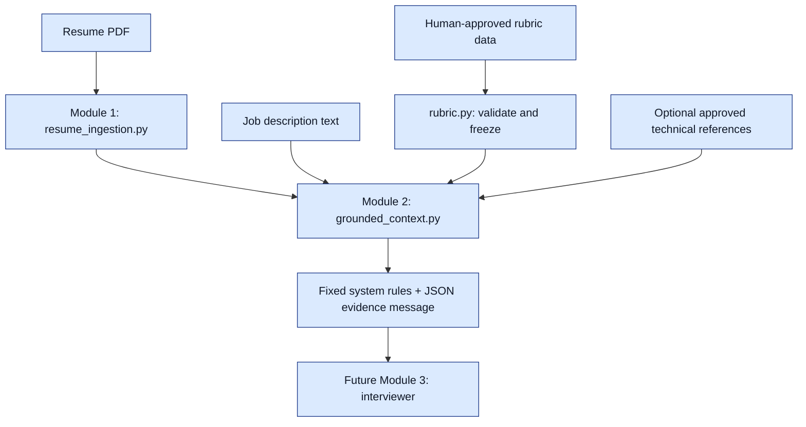

# Module 2: grounded context

This module prepares the evidence the interviewer will receive. It runs locally with standard Python and the existing Loguru logger. No model or database is involved.



## How the code works

1. **`rubric.py`: validation.** `load_approved_rubric()` accepts the JSON shape documented in `evaluation-engine-prompt.md`. It rejects unknown fields, duplicate IDs, invalid weights, and missing score anchors. Pass `human_approved=True` only after actual human review. This flag is caller confirmation; an authenticated approval screen comes later.
2. **`rubric.py`: immutable data.** `RubricCriterion` holds one competency. `ApprovedRubric` holds the role and its criteria. Frozen dataclasses prevent ordinary field changes, and tuples prevent list edits. The loader copies input data, so editing the original dictionary cannot change an interview's rubric.
3. **`rubric.py`: content hash.** The rubric is serialized consistently and hashed with SHA-256. Think of this as a content fingerprint. Changing a definition, weight, anchor or version changes the hash. The hash is not proof of human approval.
4. **`grounded_context.py`: source records.** `ContextSource` holds exact text and its source ID. Resume sources retain document ID and page number. Technical references retain a human-provided document citation or URL; this module does not fetch URLs or verify their truth.
5. **`grounded_context.py`: composition.** `build_grounded_context()` takes Module 1's `ResumeDocument`, job text, an `ApprovedRubric`, and optional `TechnicalReference` values. It validates these inputs and assembles the package. This is the composition point for these modules; a live application orchestrator will be added when the interviewer is wired up.
6. **`grounded_context.py`: messages.** `to_messages()` produces fixed system instructions and a separate user message containing JSON evidence. Quotes inside documents remain JSON data and cannot create additional message roles. Actual LLM behavior still needs adversarial evaluation.

Source examples: `resume-page-2`, `job-description`, `rubric:reasoning`, `technical-reference:memory`. Resume IDs are scoped to one context package; document IDs preserve which resume supplied each page.

## Verification

Run these commands in a terminal from `interviewflow-ai/server`, outside the Python `>>>` prompt:

```powershell
uv run pytest -q tests/test_rubric.py tests/test_grounded_context.py
uv run pytest -q
```

The separate test modules check rubric validation, approval requirements, immutability, content hashing, exact source preservation, message separation, deterministic output, metadata-only logs and a generated PDF flowing through both modules.

These are deterministic checks, so pytest is appropriate. DeepEval grounding and relevance tests belong with Module 3's generated responses. This module does not prove that an LLM will obey the rules, independently verify resume claims, or enforce a model's context-window limit. Missing technical reference evidence must produce uncertainty when the interviewer/evaluator is connected.
