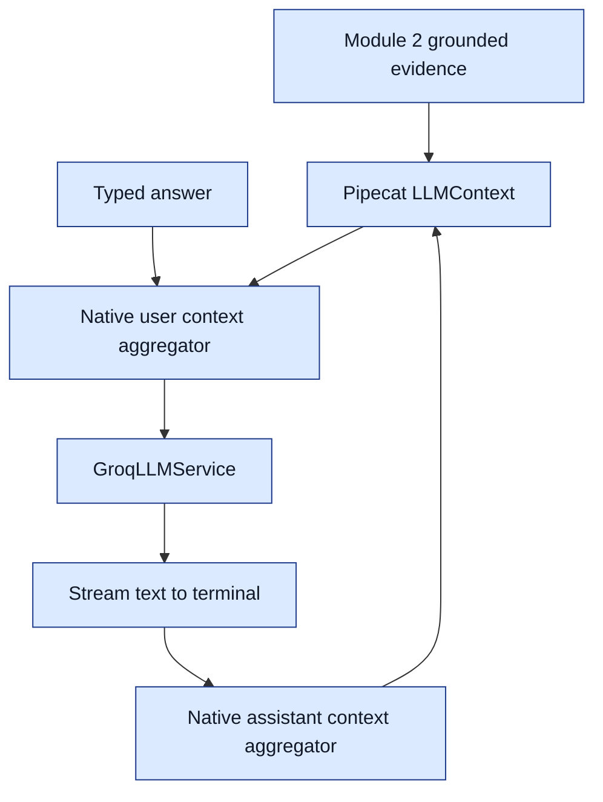

# Module 3: text interviewer

Status: implementation and offline tests pass. The first live Groq judged evaluation completed and failed the quality gate; see [actual scores and review](module-3-evaluation-results.md). Module 4 has not started.

## What each file does

- `server/interviewflow/interviewer.py`: holds interview instructions, reads the Groq key/model, and creates Pipecat's `GroqLLMService`. The key is excluded from the settings object's printed representation. Default model: `openai/gpt-oss-20b`.
- `server/interviewflow/interview_session.py`: the orchestrator. It takes Module 2's evidence package, creates Pipecat's conversation context, connects the pipeline and owns its lifecycle. Typed answers enter using `LLMMessagesAppendFrame`; the native user aggregator adds them to history and triggers inference. The assistant aggregator records the completed reply.
- `_TextOutput` in that file: forwards streamed text to the terminal callback and records time to first text. It does not generate or rewrite replies. Pipecat token-usage metrics are logged as counts.
- `server/interviewflow/logging_setup.py`: configures metadata-only application logs. Third-party logs are excluded because they can contain complete prompts or provider error bodies. Configure this before constructing services in any future entrypoint too.
- `server/scripts/chat_interview.py`: loads documents, accepts typed answers, prints streamed responses, and closes the session on `/quit`.
- `server/scripts/evaluate_interviewer.py`: replays fictional multi-turn scenarios and writes a local report under ignored `server/reports/`. With explicit `--judge`, it uses Pipecat's `EvalJudge` and a DeepEval G-Eval metric. It is a text-component evaluation, not a Pipecat eval-transport/audio end-to-end test.



## Run it

Use a terminal shell, outside Python's `>>>` prompt:

```powershell
cd "C:\Users\mrina\Desktop\Voice_ai\interviewflow-ai\server"
uv sync
```

Set `GROQ_API_KEY` in the new project's `interviewflow-ai/.env` using `.env.example` as a guide, or explicitly reuse the existing key file with `--env-file ../../server/.env`. The program never copies that file or prints its key.

Review `server/examples/interview.json` first. It contains a fictional resume, a job description and a sample rubric. `--approve-rubric` confirms you have reviewed the rubric; it is not automatic approval.

```powershell
uv run python scripts/chat_interview.py --approve-rubric --env-file ../../server/.env
```

To use a real PDF, edit your own input JSON with the appropriate job description and reviewed rubric, then supply both paths:

```powershell
uv run python scripts/chat_interview.py --inputs "C:\path\to\interview.json" --resume "C:\path\to\resume.pdf" --approve-rubric --env-file ../../server/.env
```

This sends the extracted resume, job description, rubric, optional approved references and conversation text to Groq. Raw PDF bytes stay local. Conversation history is held in memory and is not saved by the chat command. Type `/quit` to exit. `--smoke` produces one opening reply and exits.

## Tests and evaluation

```powershell
uv run --group eval pytest -q
uv run python scripts/evaluate_interviewer.py --approve-rubric --env-file ../../server/.env
```

The first command runs offline tests, including fake provider failures. The second makes six live interviewer calls with fictional data; it checks question-mark count and whether emitted citation IDs exist. Neither structural check proves semantic correctness or citation completeness.

After approving a judge model, set `GROQ_JUDGE_MODEL` explicitly, then run:

```powershell
uv run --group eval python scripts/evaluate_interviewer.py --approve-rubric --judge --env-file ../../server/.env
```

The judge mode adds Pipecat behavior verdicts and a DeepEval score for grounding/relevance against the scenario expectation and full conversation. The initial DeepEval threshold is 0.8, an engineering starting point that needs human calibration. Judge calls use Groq and consume extra tokens. DeepEval telemetry is disabled by the evaluation entrypoint. No judge provider is silently selected. Same-provider/model-family judgments can share biases with the interviewer.

## Observed results and limits

- Offline suite: 72 tests passed with the optional evaluation group installed. Two warnings come from upstream Pipecat dependencies.
- Six-turn 20B rerun: opening first text 2.40 seconds; subsequent turns 0.53–1.14 seconds.
- Six-turn 120B comparison: opening first text 2.56 seconds; subsequent turns 0.68–1.14 seconds.
- These are single local runs using one fictional fixture, not production latency guarantees. Reports are in `server/reports/module-3-refined.json` and `module-3-120b.json`.
- Manual review found corrections and missing-evidence handling worked in these samples. Compound questions and inconsistent citations remain open quality issues. 120B redirected the injection attempt back to the interview more successfully in this run; the default remains 20B pending a broader quality comparison.
- Live judge evaluation: G-Eval mean 0.833 with 5/6 passing at threshold 0.8; Pipecat 4/6 passing. Manual review identified judge blind spots. See the linked results report; these scores do not establish production quality.
- A turn has a 30-second overall deadline. Provider errors, empty responses and timeouts stop the session with a safe message. A partially displayed response must not be treated as complete.
- Context is limited to 24,000 UTF-8 bytes including instructions/history. This is a conservative application budget, not an exact token count or a guarantee against account rate limits. Oversized context is rejected without truncating evidence. Model-specific token budgeting can replace this when measured requirements justify it.
- There is no microphone, TTS, scoring or strict 15-minute enforcement in this module.

## References checked

- [Pipecat Groq service](https://docs.pipecat.ai/api-reference/server/services/llm/groq)
- [Pipecat context management](https://docs.pipecat.ai/pipecat/learn/context-management)
- [Pipecat evaluation library](https://docs.pipecat.ai/pipecat/evals/library)
- [StudyPal example](https://github.com/pipecat-ai/pipecat-examples/tree/main/studypal)
- [DeepEval custom model adapter](https://deepeval.com/guides/guides-using-custom-llms)
- [DeepEval G-Eval](https://deepeval.com/docs/metrics-llm-evals)

Implementation signatures were checked against the installed Pipecat 1.8.1 source. The complete PDF/context path stays outside the live per-turn processor chain, consistent with the document-grounded example pattern.
